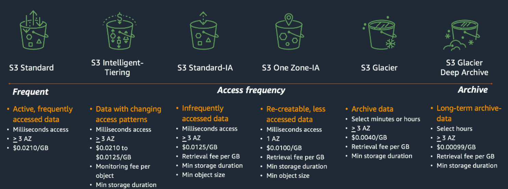

# 1. Amazon Simple Storage Service (Amazon S3)

# 💾 **物件檔案儲存服務** S3

---

Amazon S3 是物件儲存服務，意即將資料當做物件存放在儲存貯體 (bucket) 的服務。使用者可在許多應用案例中使用 S3 來存放任意數量的資料，例如網站、行動應用程式、備份和還原、企業應用程式、物聯網 (IoT) 裝置及大數據分析。此外，S3 與眾多雲端空間不同的優勢，在於其提供版本控制的功能，使用者可保留、擷取和還原在儲存貯體中所存放每個物件的各個版本，便可輕鬆復原如失誤操作導致故障的檔案與應用程式。

# 🧺 儲存貯體 Bucket

---

儲存貯體是 Amazon S3 中用於存放物件的容器。使用者可以在儲存貯體中存放任意數目的物件，一個帳戶中預設最多可有 100 個儲存貯體。由於 S3 中的每個物件都儲存在儲存貯體中，因此在上傳任何物件前須先進行的第一件事就是建立新儲存貯體以存放物件。物件可以是任何類型的檔案：文字檔、相片、影片、.zip 檔等等。

# 📑 版本控制

---

版本控制是在相同儲存貯體中保有多個不同物件版本的方法。使用者可以使用版本控制功能來保留、擷取和恢復在 S3 儲存貯體中存放的每個物件的每個版本。透過版本控制，使用者可從非預期的使用者動作和應用程式故障中輕鬆復原。

# 📝 ****儲存方案****

---

*image src: https://catalog.us-east-1.prod.workshops.aws/*

Amazon S3 針對不同使用案例提供各式各樣的儲存類別。例如，將資料存放在 S3 Standard 中，以便經常存取；將不常存取的資料存放在 S3 Standard – IA 或 S3 單區域 – IA 中，以節省成本；以及以最低成本在 S3 Glacier Instant Retrieval、S3 Glacier Flexible Retrieval 和 S3 Glacier Deep Archive 中封存資料。