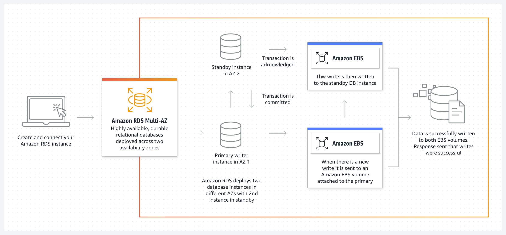

# 4. Amazon Relational Database Services (Amazon RDS)

# 🗃️ **Amazon RDS**

---

Amazon Relational Database Services (Amazon RDS) 提供使用者操作關聯式資料庫，相較於傳統資料庫受限於複雜的建立過程與專業的維護人員， Amazon RDS 讓使用者可以更簡單設定與擴展關聯式資料庫。Amazon RDS 是受管資料庫服務，並能管理備份、軟體修補、自動故障偵測與復原作業。

# ⚙️ 資料庫引擎

---

資料庫引擎是在資料庫執行個體上執行的關聯式資料庫軟體。

Amazon RDS 目前支援下列6種引擎：

- Amazon Aurora
- MySQL
- MariaDB
- Oracle
- SQL Server
- PostgreSQL

# 📦 ****異地同步備份 Multi-AZ deployment****

---

*image src: https://aws.amazon.com/*

在 Amazon RDS 異地同步備份部署中，Amazon RDS 會自動建立主要資料庫 (DB) 執行個體，並將資料同步複寫到不同可用區中的執行個體。當資料庫發生問題或故障時，Amazon RDS 會自動容錯移轉到備用執行個體，無需手動介入。

# ✏️ 僅供讀取副本 Read Replica

---

在 Amazon RDS 建立僅供讀取副本時，可用於降低主資料庫的負載，且所有僅供讀取複本皆可供存取，並可用於讀取擴展。使用 Amazon RDS for MySQL、MariaDB、PostgreSQL、Oracle 和 SQL Server 可在每個資料庫執行個體最多新增 5 個僅供讀取複本。